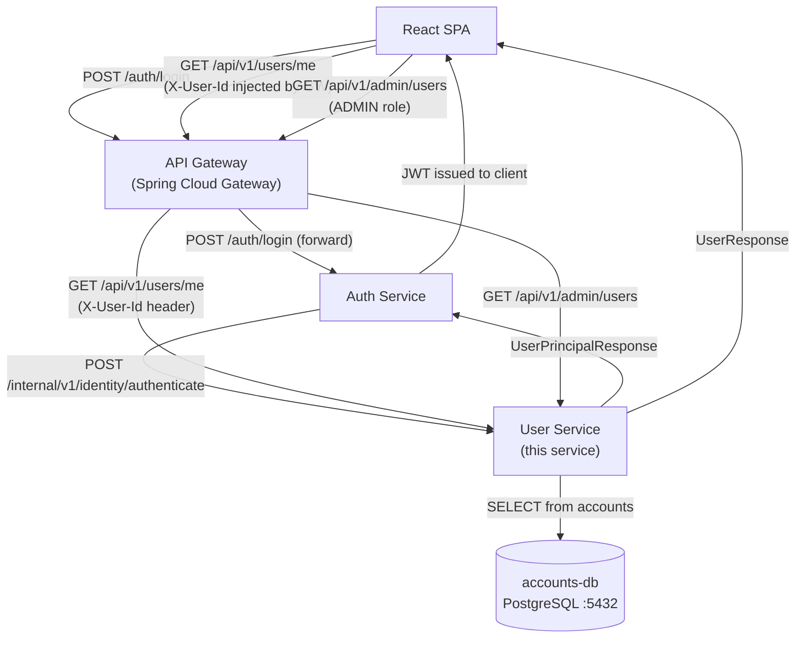
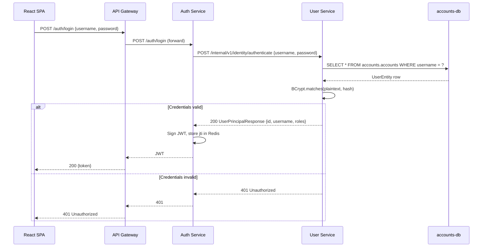
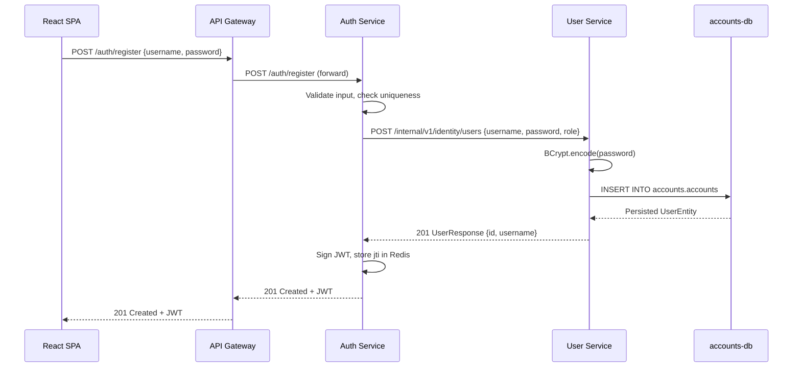
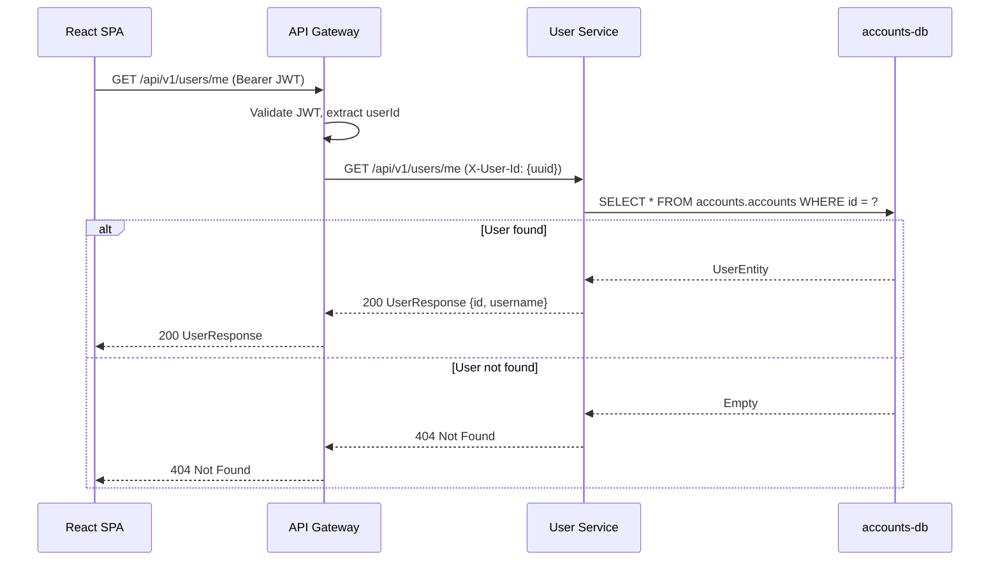

# Design Document: User Service

## Overview

The User Service is the authoritative source of identity within the Fitness Tracker microservices ecosystem. It manages the complete lifecycle of user accounts — registration, profile retrieval, and soft-deletion — and provides the internal credential-lookup interface that the Auth Service depends on to authenticate users and issue JWTs.

The service is deliberately narrow in scope: it owns user data and nothing else. It does not issue tokens, does not validate sessions, and does not perform authorization checks beyond what is implied by role storage. All JWT concerns belong to the Auth Service; all routing and identity propagation concerns belong to the API Gateway.

This design formalizes the existing Spring Boot 3.4 / Java 21 implementation, resolves the known API versioning inconsistency (current code uses `/api/users/` instead of the arc42-specified `/api/v1/`), and documents the contract, data model, security model, and deployment approach for this service.

## Architecture

### Position in the System

The User Service sits at the center of the security bootstrap flow. On every login, the API Gateway delegates credential verification to the Auth Service, which in turn calls the User Service's internal identity endpoint to retrieve the stored password hash and role. On every subsequent request, the API Gateway validates the JWT and injects an `X-User-Id` header so downstream services — including this one — never touch a token directly.



### API Surface Overview

The service exposes three distinct API surfaces, each with different trust and access semantics:

| Surface | Path Prefix | Consumer | Trust Level |
|---|---|---|---|
| User-facing (public) | `/api/v1/users/` | Authenticated end-users via Gateway | Gateway-validated identity via `X-User-Id` |
| Internal | `/internal/v1/identity/` | Auth Service (service-to-service) | Network-level trust (cluster-internal only) |
| Admin | `/api/v1/admin/users/` | ADMIN-role users via Gateway | Gateway-validated identity + role |

> **Versioning note**: The existing implementation uses `/api/users/` and `/internal/users/`. This must be updated to `/api/v1/users/` and `/internal/v1/identity/` to align with the arc42 specification.

## Components and Interfaces

### UserController (User-Facing Endpoints)

**Purpose**: Exposes the user profile endpoint routed through the API Gateway. Receives the authenticated user's identity via the `X-User-Id` header injected by the Gateway after JWT validation.

**Interface**:

```java
@RestController
@RequestMapping("/api/v1/users")
public class UserController {

    // Returns the profile of the currently authenticated user.
    // X-User-Id is set by the API Gateway — never trusted from external clients directly.
    @GetMapping("/me")
    ResponseEntity<UserResponse> getMe(@RequestHeader("X-User-Id") String userId);
}
```

**Responsibilities**:
- Parse `X-User-Id` header and delegate to `UserService.findById()`
- Return `404 Not Found` if no user exists for the given UUID
- Never expose `passwordHash` or internal fields

---

### InternalController (Auth Service Integration)

**Purpose**: Internal-only REST interface used exclusively by the Auth Service during the login and registration flows. Must not be reachable from external traffic — enforced at the network/ingress level.

**Interface**:

```java
@RestController
@RequestMapping("/internal/v1/identity")
public class InternalController {

    // Verifies plaintext password against stored BCrypt hash.
    // Returns id + username + role if credentials are valid; 401 otherwise.
    @PostMapping("/authenticate")
    ResponseEntity<UserPrincipalResponse> authenticate(@RequestBody @Valid AuthRequest request);

    // Creates a new user account triggered during Auth Service registration.
    // Returns 201 Created with the persisted entity.
    @PostMapping("/users")
    ResponseEntity<UserResponse> create(@RequestBody @Valid UserCreateRequest request);
}
```

**Responsibilities**:
- Password verification via `BCryptPasswordEncoder.matches()`
- Role assignment defaulting to `USER` when none is provided
- Password hashing on create via `BCryptPasswordEncoder.encode()`

---

### AdminController (Admin Operations)

**Purpose**: Provides administrative visibility and lifecycle management for user accounts. Only accessible by users whose JWT contains the `ADMIN` role, enforced by the API Gateway.

**Interface**:

```java
@RestController
@RequestMapping("/api/v1/admin/users")
public class AdminController {

    // Lists all accounts; passwords stripped via UserMapper.
    @GetMapping
    ResponseEntity<List<UserResponse>> listAll();

    // Soft-deletes a user by UUID (sets deleted_at = 'T').
    @DeleteMapping("/{id}")
    ResponseEntity<Void> remove(@PathVariable UUID id);
}
```

**Responsibilities**:
- Expose all non-deleted user accounts to admins
- Soft-delete (not hard-delete) accounts on `DELETE` — sets `deleted_at` flag via Hibernate `@SoftDelete`
- Strip sensitive fields using `UserMapper`

---

### UserService

**Purpose**: Core business logic layer. Orchestrates all user operations and is the only class permitted to call `UserRepository`.

**Interface**:

```java
@Service
public class UserService {
    Optional<UserEntity> findById(UUID id);
    Optional<UserPrincipalResponse> authenticate(String username, String plainPassword);
    UserEntity createUser(UserCreateRequest request);
    Iterable<UserEntity> getAllUsers();
    void deleteUser(UUID id);
}
```

**Responsibilities**:
- Encapsulate all credential-handling logic (hashing, matching)
- Map role strings to `UserEntity.Role` enum with `USER` fallback
- Delegate all persistence to `UserRepository`

---

### UserRepository

**Purpose**: Spring Data JPA repository providing persistence operations against the `accounts.accounts` table.

**Interface**:

```java
@Repository
public interface UserRepository extends JpaRepository<UserEntity, UUID> {
    Optional<UserEntity> findByUsername(String username);
}
```

---

### UserMapper

**Purpose**: Converts between `UserEntity` domain objects and safe API response DTOs, ensuring `passwordHash` is never exposed.

**Interface**:

```java
@Component
public class UserMapper {
    UserResponse toResponse(UserEntity user);
}
```

## Data Models

### UserEntity (JPA Entity → `accounts.accounts`)

```java
@Entity
@Table(name = "accounts", schema = "accounts")
@SoftDelete(columnName = "deleted_at", converter = TrueFalseConverter.class)
public class UserEntity {
    @Id @GeneratedValue(strategy = GenerationType.AUTO)
    UUID id;                        // PRIMARY KEY, gen_random_uuid()

    @Column(nullable = false, unique = true, length = 50)
    String username;                // UNIQUE, NOT NULL

    @Column(name = "password_hash", nullable = false, length = 255)
    String passwordHash;            // BCrypt hash, NOT NULL, never serialized to API

    @Enumerated(EnumType.STRING)
    @Column(length = 32)
    Role roles;                     // 'USER' | 'ADMIN'

    @CreationTimestamp
    @Column(name = "created_at", updatable = false)
    OffsetDateTime createdAt;

    @UpdateTimestamp
    @Column(name = "updated_at")
    OffsetDateTime updatedAt;

    // deleted_at managed by @SoftDelete — 'F' (active) or 'T' (deleted)
    // Hibernate automatically filters deleted_at = 'T' from all queries

    enum Role { USER, ADMIN }
}
```

**PostgreSQL Schema** (`accounts.accounts`):

```sql
CREATE TABLE accounts.accounts (
    id           UUID          PRIMARY KEY DEFAULT gen_random_uuid(),
    username     VARCHAR(50)   UNIQUE NOT NULL,
    password_hash VARCHAR(255) NOT NULL,
    roles        VARCHAR(32)   CHECK (roles IN ('USER', 'ADMIN')),
    deleted_at   CHAR(1)       NOT NULL DEFAULT 'F',
    created_at   TIMESTAMPTZ   NOT NULL DEFAULT CURRENT_TIMESTAMP,
    updated_at   TIMESTAMPTZ   NOT NULL DEFAULT CURRENT_TIMESTAMP
);
```

**Validation Rules**:
- `username`: 1–50 characters, must be unique
- `password`: raw value max 255 chars in request; stored as BCrypt hash (always 60 chars)
- `roles`: must be `USER` or `ADMIN`; defaults to `USER` if absent or unrecognized
- Soft-delete: `deleted_at` set to `'T'` on deletion; Hibernate filters these rows automatically

---

### DTOs

```java
// Request to create a new user account (internal use only)
record UserCreateRequest(
    @NotBlank @Size(max = 50) String username,
    @NotBlank @Size(max = 255) String password,  // plain password from registration flow
    @Size(max = 32) @Pattern(regexp = "USER|ADMIN") String roles
) {}

// Request to authenticate a user (internal use only)
record AuthRequest(
    String username,
    String password
) {}

// Safe public response — no credentials exposed
record UserResponse(
    UUID id,
    String username
) {}

// Internal response to Auth Service after successful authentication
record UserPrincipalResponse(
    UUID id,
    String username,
    UserEntity.Role roles
) {}
```

## Sequence Diagrams

### Login Flow (Auth Service Delegation)



### User Registration Flow

> **Why registration flows through Auth Service**: Registration requires two things to happen together — persisting the user credential and establishing a session. The Auth Service owns both. By routing `POST /auth/register` through Auth Service, the client gets a single round-trip that validates the input, calls the User Service internal endpoint to persist the credential, and immediately issues a JWT. The alternative (client calls User Service directly, then Auth Service to log in) requires two round-trips and leaves a window where the user exists but has no session. The `POST /internal/v1/identity/users` endpoint exists solely to serve this Auth Service call.



### Get Current User Profile



## Security Model

The User Service contains no Spring Security configuration for route-level authorization. Access control is enforced at the following boundaries:

### Defence-in-Depth for Internal Endpoints

The `/internal/v1/identity/` paths are sensitive — they expose raw credential lookup and user creation. Three layers of defence apply:

| Layer | Mechanism | What it prevents |
|---|---|---|
| **Ingress** | No Ingress rule for `/internal/**` paths | External internet traffic reaching the service |
| **NetworkPolicy** | K8s `NetworkPolicy` allowing only the Auth Service pod to reach user-service on port 8081 | Lateral movement from other cluster pods |
| **Application (known gap)** | None currently implemented | Direct pod access via `kubectl port-forward` or a compromised in-cluster pod |

For this POC, Ingress + NetworkPolicy is the implemented defence. The application-level gap is a known accepted risk. In a production deployment, a shared secret header (`X-Internal-Token`) or mTLS between Auth Service and User Service would close this gap. Spring Security IP-based filtering is not reliable in Kubernetes because pod IPs are ephemeral.

> **NetworkPolicy to implement**: Allow ingress to user-service port 8081 from pods with label `app=auth-service` only. All other in-cluster pod-to-pod traffic to port 8081 should be denied by default.

### API Gateway Controls

The API Gateway validates JWT on every inbound request and injects `X-User-Id`. Routes tagged as admin-only are rejected at the Gateway for non-ADMIN roles.

### Password Security

BCrypt with strength 10 (`BCryptPasswordEncoder(10)`) is used for all password hashing. The `PasswordEncoder` bean is defined in `PasswordSecurityConfig` and injected wherever needed. Raw passwords never reach the database.

### SQL Injection Prevention

Spring Data JPA uses parameterized queries for all database interactions. The specific protections in place:

- **Derived query methods** (`findByUsername`, `findById`, etc.) — Hibernate generates parameterized SQL automatically. No injection risk.
- **`@Query` annotations** — must use named parameter binding (`:param` syntax), never string concatenation or interpolation. Example: `@Query("SELECT u FROM UserEntity u WHERE u.username = :username")` with `@Param("username")`.
- **`UserEntity` fields** — all string fields are mapped via JPA column annotations. No native SQL is used in the user-service.
- **BCrypt input** — plaintext passwords are passed directly to `BCryptPasswordEncoder`, not to any SQL query.

The result: there are no SQL injection attack vectors in this service provided the `@Query` convention is followed. Any future custom queries added to `UserRepository` must use `:param` binding — string-concatenated JPQL or native SQL is prohibited.

### What this service does NOT do

- Issue or validate JWTs (Auth Service responsibility)
- Store session state (Redis/Auth Service responsibility)
- Perform role-based route authorization (API Gateway responsibility)
- Accept `Authorization` headers

## Error Handling

### Error Scenarios

| Scenario | HTTP Status | Behavior |
|---|---|---|
| `GET /api/v1/users/me` — UUID not found | `404 Not Found` | `Optional.empty()` → `ResponseEntity.notFound()` |
| `POST /internal/v1/identity/authenticate` — bad credentials | `401 Unauthorized` | `Optional.empty()` → `ResponseEntity.status(401)` |
| `POST /internal/v1/identity/authenticate` — unknown username | `401 Unauthorized` | Same as bad credentials — no user-enumeration leakage |
| `POST /internal/v1/identity/users` — constraint violation (duplicate username) | `409 Conflict` | DataIntegrityViolationException → handled by global exception handler |
| `POST /internal/v1/identity/users` — validation failure | `400 Bad Request` | Bean Validation (`@Valid`) → MethodArgumentNotValidException |
| `DELETE /api/v1/admin/users/{id}` — UUID not found | `404 Not Found` | Check existence before soft-delete; return 404 if absent |
| Invalid UUID format in path/header | `400 Bad Request` | Spring's type conversion fails gracefully |

A `@RestControllerAdvice` global exception handler should be added to centralize error response formatting and map `DataIntegrityViolationException` to `409`.

## Testing Strategy

### Unit Testing

All business logic in `UserService` is covered with pure unit tests using Mockito (no Spring context). All controller behavior is covered with `@WebMvcTest` using mocked service and mapper beans.

**Coverage target**: 70% minimum enforced by JaCoCo (`config/**` package excluded per existing `pom.xml` configuration).

**Key test cases per layer**:

| Layer | Class | Scenarios |
|---|---|---|
| Service | `UserServiceTest` | authenticate success/wrong password/unknown user; createUser with valid/invalid/null role; findById present/absent; deleteUser invokes DAO |
| Controller | `UserControllerTest` | GET /me with valid header → 200; GET /me with unknown id → 404; POST authenticate valid → 200; POST authenticate invalid → 401; POST create → 201; GET admin list → 200; DELETE → 204 |
| Mapper | `UserMapperTest` | toResponse maps fields correctly; toResponse null → null; passwordHash never in response |

### Integration Testing

Integration tests use H2 in-memory with `MODE=PostgreSQL` and `ddl-auto=create-drop` to verify the full Spring context, JPA mappings, and repository queries without requiring a live PostgreSQL instance.

**Key integration test scenarios**:
- Full round-trip: create user → find by id → soft-delete → confirm soft-deleted row not returned by `findById`
- Duplicate username → constraint violation
- `authenticate()` with BCrypt-encoded password stored via `createUser()` — end-to-end password check

### Property-Based Testing (optional, for future consideration)

- Password hashing: for any non-null string input, `encode(p)` always produces a value that `matches(p, hash)` returns true for
- Role mapping: any valid role string maps to its enum; any invalid string maps to `USER`

## Performance Considerations

- **Connection pool**: HikariCP configured with `maximum-pool-size: 10`, `minimum-idle: 2`. Appropriate for a low-to-medium traffic user management service.
- **Soft deletes**: Hibernate's `@SoftDelete` automatically appends `WHERE deleted_at = 'F'` to all queries. No manual filtering needed; no index overhead concern at expected data volumes.
- **BCrypt cost factor**: Strength 10 is the recommended default. At ~100ms per hash, this is suitable for a login endpoint that is not under brute-force pressure (API Gateway should apply rate limiting).
- **UUID primary keys**: `GenerationType.AUTO` with PostgreSQL maps to `gen_random_uuid()`. For high-insert scenarios, consider `GenerationType.UUID` with explicit sequence or client-side UUID generation to avoid table locking.

## Kubernetes Deployment

### Deployment Configuration

The service is deployed to a kinD cluster using the following configuration:

```yaml
# Deployment: 2 replicas for high availability
replicas: 2
image: user-service:latest
containerPort: 8081

# Liveness probe
GET /user-service/actuator/health/liveness

# Readiness probe
GET /user-service/actuator/health/readiness

# Kubernetes Service: ClusterIP, port 80 → 8081
```

### Ingress Routing

```yaml
# Ingress paths (nginx ingress controller)
/user-service → user-service:80   # Catches all paths including /api/v1 and /internal/v1
```

> **Important**: The `/internal/v1/identity/` paths must not be externally accessible. The Ingress should be updated to only expose `/user-service/api/` externally. Internal paths are accessible only via cluster-internal DNS (`http://user-service/internal/v1/identity/...`).

### Health and Observability

Spring Boot Actuator exposes:
- `/actuator/health/liveness` — Kubernetes liveness probe
- `/actuator/health/readiness` — Kubernetes readiness probe
- `/actuator/prometheus` — Prometheus metrics scraping

The `server.shutdown: graceful` setting ensures in-flight requests complete before the pod terminates, preventing dropped requests during rolling deploys.

## Dependencies

| Dependency | Purpose |
|---|---|
| `spring-boot-starter-web` | REST controllers, Jackson serialization |
| `spring-boot-starter-data-jpa` | JPA/Hibernate ORM, `UserRepository` |
| `spring-boot-starter-validation` | Bean Validation (`@Valid`, `@NotBlank`, etc.) |
| `spring-security-crypto` | `BCryptPasswordEncoder` for password hashing |
| `spring-boot-starter-actuator` | Health probes, metrics |
| `springdoc-openapi-starter-webmvc-ui` | OpenAPI/Swagger UI at `/swagger-ui.html` |
| `postgresql` | PostgreSQL JDBC driver (runtime) |
| `lombok` | Reduces boilerplate (`@Getter`, `@Setter`, etc.) |
| `h2` (test) | In-memory database for integration tests |
| `spring-boot-starter-test` | JUnit 5, Mockito, MockMvc |
| `jacoco-maven-plugin` | Code coverage enforcement (70% threshold) |

## Correctness Properties

*A property is a characteristic or behavior that should hold true across all valid executions of a system — essentially, a formal statement about what the system should do. Properties serve as the bridge between human-readable specifications and machine-verifiable correctness guarantees.*

### Property 1: Password never leaks via UserMapper

For any `UserEntity` with any `passwordHash` value, mapping it through `UserMapper.toResponse()` produces a `UserResponse` that contains no `passwordHash` field and no credential data of any kind.

**Validates: Requirements 3.3, 4.2, 6.4**

---

### Property 2: BCrypt round-trip consistency

For any non-blank password string `p`, calling `BCrypt_Encoder.encode(p)` produces a hash `h` such that `BCrypt_Encoder.matches(p, h)` returns `true`, and `BCrypt_Encoder.matches(p', h)` returns `false` for any `p' ≠ p`. The encoded value `h` is never equal to the plaintext `p`.

**Validates: Requirements 1.2, 2.4, 6.2, 6.3**

---

### Property 3: Role assignment is total

For any `UserCreateRequest` where the `roles` field is `null`, blank, or any string other than `"USER"` or `"ADMIN"`, the resulting `UserEntity.roles` is always `Role.USER`. For `"USER"` or `"ADMIN"` inputs, the corresponding `Role` enum value is assigned. The `roles` field is never `null` on a persisted entity.

**Validates: Requirements 1.3, 1.4, 7.2**

---

### Property 4: Soft-delete makes users invisible to all queries

For any user that has been soft-deleted via `deleteUser(id)`, all subsequent application-level queries — including `findById(id)`, `findByUsername(username)`, and `findAll()` — exclude that user from their results. The underlying row remains in the database with `deleted_at = 'T'` but is never returned by any repository method.

**Validates: Requirements 4.3, 5.2, 8.2**

---

### Property 5: Authentication does not enumerate users

For any `AuthRequest`, when the credentials are invalid — whether because the username does not exist or because the password is incorrect — the `InternalController` returns `401 Unauthorized`. The HTTP status code, response body, and response headers are identical for both failure modes, so no information about username existence is revealed.

**Validates: Requirements 2.2, 2.3, 15.1, 15.2, 15.3**

---

### Property 6: Role is propagated to UserPrincipalResponse

For any user account with a stored `roles` value, a successful call to `POST /internal/v1/identity/authenticate` returns a `UserPrincipalResponse` whose `roles` field equals the stored `UserEntity.roles` enum value.

**Validates: Requirements 7.3**

---

### Property 7: Blank inputs are rejected at validation boundary

For any registration request (`POST /internal/v1/identity/users`) where `username` or `password` is composed entirely of whitespace characters or is null, the `User_Service` returns `400 Bad Request` and no `UserEntity` is persisted.

**Validates: Requirements 1.6, 14.3**

---

### Property 8: UUID identity stability

Once a user account is created, its `id` (UUID) never changes. The primary key is assigned at insertion and is not modified by any subsequent operation on the `UserEntity`.

**Validates: Requirements 1.1**

---

### Property 9: Internal endpoints are not publicly routable

Requests to `/internal/v1/identity/**` originating from outside the Kubernetes cluster never receive a successful application response. This property is enforced at the Ingress level, not in application code.

**Validates: Requirements 10.1, 10.2**
