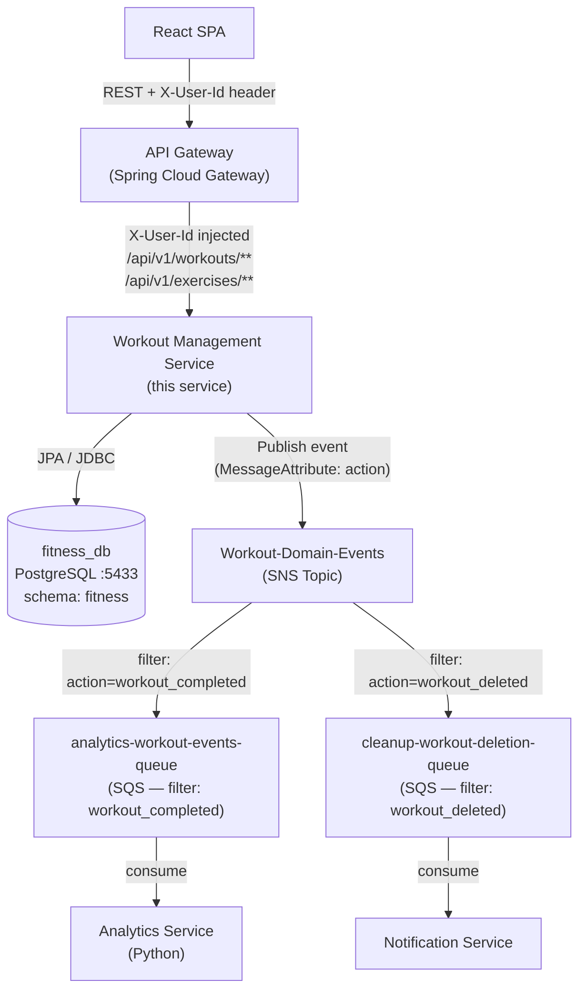
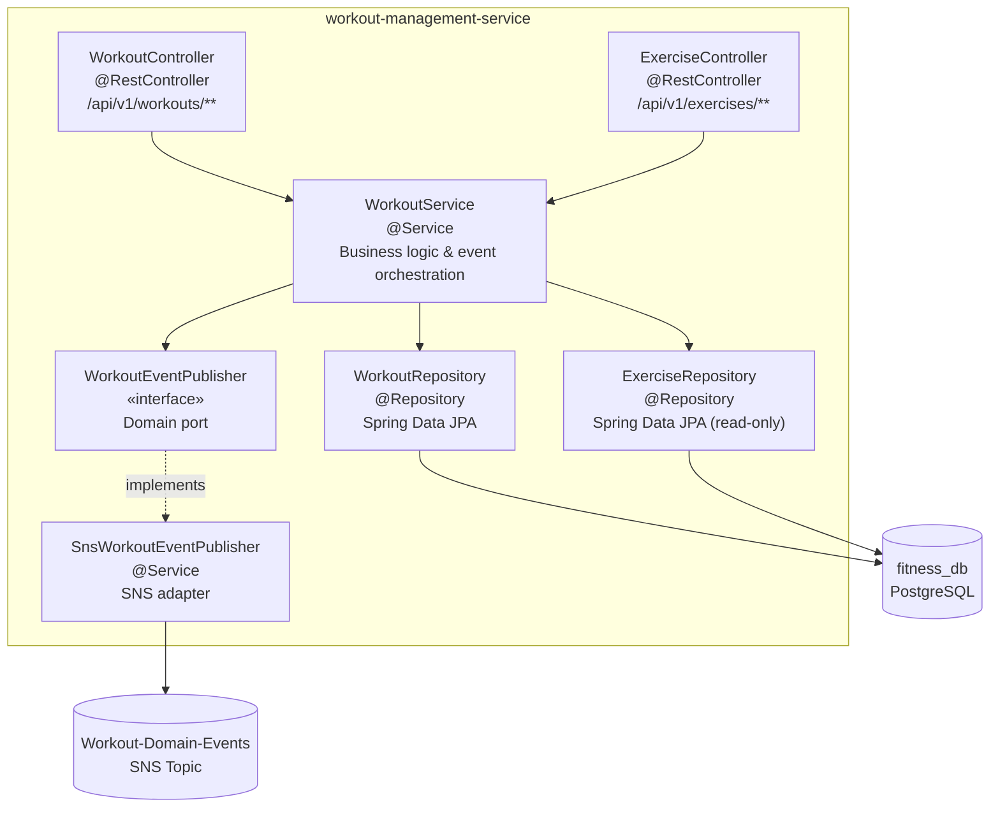
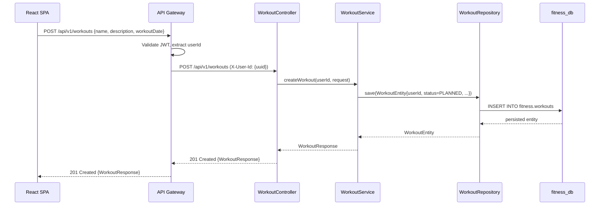
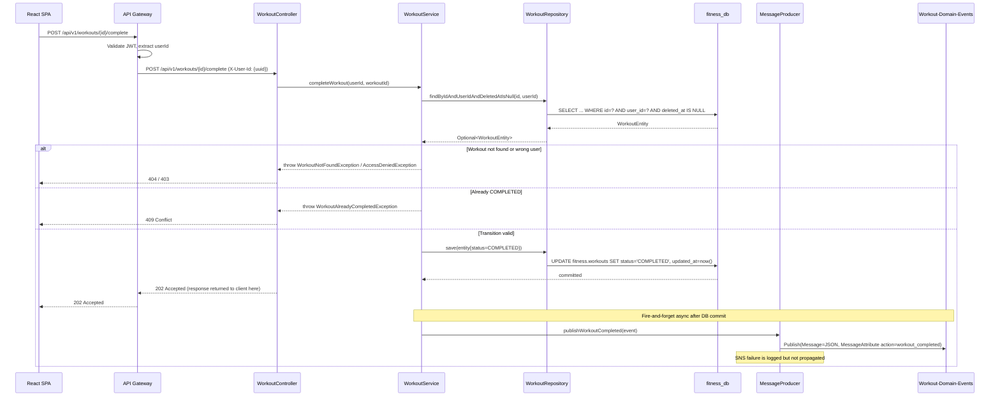
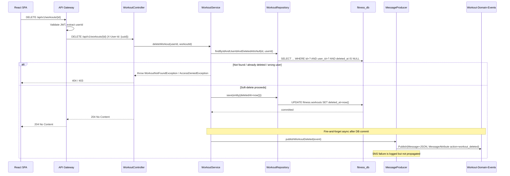
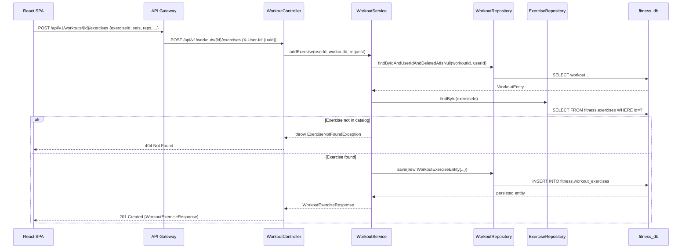

# Design Document: Workout Management Service

## Overview

The Workout Management Service (WMS) is the core domain service of the Fitness Tracker microservices ecosystem. It owns the complete lifecycle of user workouts — creation, retrieval, modification, completion, and soft-deletion — and serves as the sole producer of domain events on the asynchronous analytics and notification pipeline.

The service exposes a synchronous REST API for all CRUD operations and publishes two distinct event types to the `Workout-Domain-Events` SNS topic: `workout_completed` (triggers AI analysis via the Analytics Service) and `workout_deleted` (triggers data cleanup in the Notification Service). Event publishing uses a fire-and-forget pattern: the HTTP response is returned to the caller before SNS publish completes, and SNS failures never roll back the local database state.

This document covers the full API contract, JPA entity and DTO models, SNS event schemas, internal component architecture, sequence diagrams for all primary flows, security model, error handling, testing strategy, and correctness properties that will drive requirements generation.

## Architecture

### Position in the System

WMS sits in Tier 2 of the system — behind the API Gateway and upstream of the messaging bus. It has no synchronous dependency on any other microservice; downstream consumers (Analytics Service, Notification Service) react to its SNS events asynchronously.



### Internal Component Diagram



> **Design note**: `WorkoutService` depends on the `WorkoutEventPublisher` interface, not on `SnsWorkoutEventPublisher` directly. This port/adapter separation means unit tests and integration tests mock the interface — no LocalStack required. Only `SnsWorkoutEventPublisherTest` tests the SNS wiring.

## Components and Interfaces

### WorkoutController

**Purpose**: REST interface for all workout lifecycle operations. Receives `X-User-Id` from every request (injected by the API Gateway). Returns synchronous HTTP responses for CRUD; returns `202 Accepted` for the complete-workout action.

**Interface**:

```java
@RestController
@RequestMapping("/api/v1/workouts")
public class WorkoutController {

    // Create a new workout for the authenticated user (status = PLANNED)
    @PostMapping
    ResponseEntity<WorkoutResponse> createWorkout(
        @RequestHeader("X-User-Id") UUID userId,
        @RequestBody @Valid CreateWorkoutRequest request
    );

    // List all active (non-deleted) workouts for the authenticated user
    @GetMapping
    ResponseEntity<List<WorkoutSummaryResponse>> listWorkouts(
        @RequestHeader("X-User-Id") UUID userId
    );

    // Get a single workout with all its exercises
    @GetMapping("/{id}")
    ResponseEntity<WorkoutResponse> getWorkout(
        @RequestHeader("X-User-Id") UUID userId,
        @PathVariable UUID id
    );

    // Update workout metadata (name, description, workout_date)
    @PutMapping("/{id}")
    ResponseEntity<WorkoutResponse> updateWorkout(
        @RequestHeader("X-User-Id") UUID userId,
        @PathVariable UUID id,
        @RequestBody @Valid UpdateWorkoutRequest request
    );

    // Mark workout COMPLETED — async SNS publish, returns 202 Accepted
    @PostMapping("/{id}/complete")
    ResponseEntity<Void> completeWorkout(
        @RequestHeader("X-User-Id") UUID userId,
        @PathVariable UUID id
    );

    // Soft-delete workout — async SNS publish, returns 204 No Content
    @DeleteMapping("/{id}")
    ResponseEntity<Void> deleteWorkout(
        @RequestHeader("X-User-Id") UUID userId,
        @PathVariable UUID id
    );

    // Add an exercise entry to a workout
    @PostMapping("/{id}/exercises")
    ResponseEntity<WorkoutExerciseResponse> addExercise(
        @RequestHeader("X-User-Id") UUID userId,
        @PathVariable UUID id,
        @RequestBody @Valid AddExerciseRequest request
    );

    // Update an exercise entry within a workout
    @PutMapping("/{workoutId}/exercises/{exerciseId}")
    ResponseEntity<WorkoutExerciseResponse> updateExercise(
        @RequestHeader("X-User-Id") UUID userId,
        @PathVariable UUID workoutId,
        @PathVariable UUID exerciseId,
        @RequestBody @Valid UpdateExerciseRequest request
    );

    // Remove an exercise entry from a workout
    @DeleteMapping("/{workoutId}/exercises/{exerciseId}")
    ResponseEntity<Void> removeExercise(
        @RequestHeader("X-User-Id") UUID userId,
        @PathVariable UUID workoutId,
        @PathVariable UUID exerciseId
    );
}
```

**Responsibilities**:
- Parse and validate `X-User-Id` header on every request
- Delegate all business logic to `WorkoutService`
- Return correct HTTP status codes per the API design
- Never pass raw HTTP request/response objects to service layer

---

### ExerciseController

**Purpose**: Read-only REST interface for the exercise catalog. Does not require `X-User-Id` because exercises are global (no user isolation needed).

**Interface**:

```java
@RestController
@RequestMapping("/api/v1/exercises")
public class ExerciseController {

    // List all exercises — supports optional query filtering
    @GetMapping
    ResponseEntity<List<ExerciseResponse>> listExercises(
        @RequestParam(required = false) String type,
        @RequestParam(required = false) String targetArea,
        @RequestParam(required = false) String difficulty,
        @RequestParam(required = false) String equipment
    );

    // Get a single exercise by ID
    @GetMapping("/{id}")
    ResponseEntity<ExerciseResponse> getExercise(@PathVariable UUID id);
}
```

**Responsibilities**:
- Forward filter parameters to service layer without business logic
- Return `404 Not Found` if exercise ID doesn't exist

---

### WorkoutService

**Purpose**: Core business logic layer. Enforces user data isolation on every operation, manages status transitions, and determines when to publish SNS events.

**Interface**:

```java
@Service
public class WorkoutService {

    WorkoutResponse createWorkout(UUID userId, CreateWorkoutRequest request);

    List<WorkoutSummaryResponse> listWorkouts(UUID userId);

    WorkoutResponse getWorkout(UUID userId, UUID workoutId);

    WorkoutResponse updateWorkout(UUID userId, UUID workoutId, UpdateWorkoutRequest request);

    // Sets status = COMPLETED, then fire-and-forget publishes workout_completed event
    void completeWorkout(UUID userId, UUID workoutId);

    // Sets deleted_at = now(), then fire-and-forget publishes workout_deleted event
    void deleteWorkout(UUID userId, UUID workoutId);

    WorkoutExerciseResponse addExercise(UUID userId, UUID workoutId, AddExerciseRequest request);

    WorkoutExerciseResponse updateExercise(UUID userId, UUID workoutId, UUID exerciseId, UpdateExerciseRequest request);

    void removeExercise(UUID userId, UUID workoutId, UUID exerciseId);

    List<ExerciseResponse> listExercises(String type, String targetArea, String difficulty, String equipment);

    ExerciseResponse getExercise(UUID exerciseId);
}
```

**Responsibilities**:
- All queries to `WorkoutRepository` must include `userId` filter — no cross-user data access
- Validate that the referenced `exerciseId` exists in the catalog before adding to a workout
- SNS publish happens after the local transaction commits via `WorkoutEventPublisher` — fire-and-forget with `@Async` or direct async invocation
- `WorkoutService` depends on `WorkoutEventPublisher` (the interface), never on `SnsWorkoutEventPublisher` directly
- `completeWorkout`: throw `409 Conflict` if workout is already `COMPLETED`
- `deleteWorkout`: throw `404 Not Found` if workout doesn't exist or is already soft-deleted
- `completeWorkout` / `deleteWorkout` / `addExercise` / `updateExercise` / `removeExercise`: throw `403 Forbidden` if the workout belongs to a different user

---

### WorkoutRepository

**Purpose**: Spring Data JPA repository for the `fitness.workouts` and `fitness.workout_exercises` tables. Soft-delete filtering is handled at the query level (no Hibernate `@SoftDelete` — WMS uses a `TIMESTAMPTZ` column, not a CHAR flag).

**Interface**:

```java
@Repository
public interface WorkoutRepository extends JpaRepository<WorkoutEntity, UUID> {

    // Active workouts only (deleted_at IS NULL), filtered by user
    List<WorkoutEntity> findByUserIdAndDeletedAtIsNull(UUID userId);

    // Single active workout by id and user (ownership check + soft-delete guard)
    Optional<WorkoutEntity> findByIdAndUserIdAndDeletedAtIsNull(UUID id, UUID userId);
}
```

**Note**: `WorkoutExerciseEntity` operations (add/update/remove) are handled via the `WorkoutEntity` relationship or a dedicated `WorkoutExerciseRepository`.

---

### ExerciseRepository

**Purpose**: Read-only Spring Data JPA repository for the `fitness.exercises` catalog. WMS never writes to this table.

**Interface**:

```java
@Repository
public interface ExerciseRepository extends JpaRepository<ExerciseEntity, UUID> {

    // Supports optional filter combinations — implemented with @Query or Specification
    List<ExerciseEntity> findByFilters(String type, String targetArea, String difficulty, String equipment);
}
```

---

### WorkoutEventPublisher (Port Interface)

**Purpose**: A domain-level interface that decouples `WorkoutService` from the SNS infrastructure. `WorkoutService` depends on this interface, not on any SNS client directly. This allows integration tests to inject a no-op or spy implementation without requiring LocalStack.

**Interface**:

```java
public interface WorkoutEventPublisher {

    // Called after completeWorkout DB commit
    void publishWorkoutCompleted(WorkoutCompletedEvent event);

    // Called after deleteWorkout DB commit
    void publishWorkoutDeleted(WorkoutDeletedEvent event);
}
```

---

### SnsWorkoutEventPublisher (Adapter — SNS Implementation)

**Purpose**: The production implementation of `WorkoutEventPublisher`. Holds the AWS SDK v2 `SnsClient` and translates domain events into SNS `PublishRequest` calls. All SNS calls are fire-and-forget: exceptions are caught, logged, and not rethrown.

**Interface**:

```java
@Service
public class SnsWorkoutEventPublisher implements WorkoutEventPublisher {

    // Publishes workout_completed event with action=workout_completed MessageAttribute
    @Override
    public void publishWorkoutCompleted(WorkoutCompletedEvent event);

    // Publishes workout_deleted event with action=workout_deleted MessageAttribute
    @Override
    public void publishWorkoutDeleted(WorkoutDeletedEvent event);
}
```

**SNS Client Configuration**:
- Endpoint override: `http://localhost:4566` (LocalStack) when profile = `local`
- Region: `us-east-1`
- Topic ARN: `arn:aws:sns:us-east-1:000000000000:Workout-Domain-Events`
- Message attribute `action` drives SNS filter policy routing

**Why this pattern:**
`WorkoutService` is injected with `WorkoutEventPublisher` (the interface). In unit and integration tests, Mockito mocks the interface — no LocalStack required. Only the `SnsWorkoutEventPublisher` tests need a live or mocked SNS client. This keeps the domain logic testable in isolation from AWS infrastructure.

## Data Models

### JPA Entities

#### WorkoutEntity (`fitness.workouts`)

```java
@Entity
@Table(name = "workouts", schema = "fitness")
public class WorkoutEntity {

    @Id
    @GeneratedValue(strategy = GenerationType.UUID)
    UUID id;                        // PRIMARY KEY, gen_random_uuid()

    @Column(name = "user_id", nullable = false)
    UUID userId;                    // Cross-service UUID reference — no FK constraint

    @Column(length = 255)
    String name;

    @Column(columnDefinition = "TEXT")
    String description;

    @Column(name = "workout_date")
    OffsetDateTime workoutDate;

    @Enumerated(EnumType.STRING)
    @Column(nullable = false, length = 32)
    WorkoutStatus status;           // PLANNED | COMPLETED

    @CreationTimestamp
    @Column(name = "created_at", updatable = false)
    OffsetDateTime createdAt;

    @UpdateTimestamp
    @Column(name = "updated_at")
    OffsetDateTime updatedAt;

    @Column(name = "deleted_at")
    OffsetDateTime deletedAt;       // NULL = active, non-NULL = soft-deleted

    @OneToMany(mappedBy = "workout", cascade = CascadeType.ALL, orphanRemoval = true)
    List<WorkoutExerciseEntity> exercises;

    public enum WorkoutStatus { PLANNED, COMPLETED }
}
```

#### WorkoutExerciseEntity (`fitness.workout_exercises`)

```java
@Entity
@Table(name = "workout_exercises", schema = "fitness")
public class WorkoutExerciseEntity {

    @Id
    @GeneratedValue(strategy = GenerationType.UUID)
    UUID id;

    @ManyToOne(fetch = FetchType.LAZY)
    @JoinColumn(name = "workout_id", nullable = false)
    WorkoutEntity workout;

    @ManyToOne(fetch = FetchType.LAZY)
    @JoinColumn(name = "exercise_id", nullable = false)
    ExerciseEntity exercise;

    Integer sets;                   // CHECK sets > 0
    Integer reps;                   // CHECK reps > 0

    @Column(precision = 10, scale = 2)
    BigDecimal weight;              // CHECK weight >= 0

    @Column(precision = 10, scale = 2)
    BigDecimal duration;

    @Column(columnDefinition = "TEXT")
    String notes;

    @Column(name = "exercise_order")
    Integer exerciseOrder;

    @CreationTimestamp
    @Column(name = "created_at", updatable = false)
    OffsetDateTime createdAt;

    @UpdateTimestamp
    @Column(name = "updated_at")
    OffsetDateTime updatedAt;
}
```

#### ExerciseEntity (`fitness.exercises` — read-only)

```java
@Entity
@Table(name = "exercises", schema = "fitness")
@Immutable                          // Hibernate: prevents accidental writes
public class ExerciseEntity {

    @Id
    UUID id;

    @Column(nullable = false, unique = true, length = 256)
    String name;

    @Column(length = 32)
    String type;

    @Column(name = "target_area", length = 32)
    String targetArea;

    @Column(name = "primary_muscle", length = 256)
    String primaryMuscle;

    @Column(name = "sec_muscle", length = 256)
    String secMuscle;

    @Column(length = 32)
    String equipment;

    @Column(length = 32)
    String mechanic;

    @Column(length = 32)
    String difficulty;

    @CreationTimestamp
    @Column(name = "created_at", updatable = false)
    OffsetDateTime createdAt;

    @UpdateTimestamp
    @Column(name = "updated_at")
    OffsetDateTime updatedAt;
}
```

---

### Request/Response DTOs

```java
// ── Workout Request DTOs ──────────────────────────────────────────────────────

record CreateWorkoutRequest(
    @Size(max = 255) String name,
    String description,
    OffsetDateTime workoutDate
) {}

record UpdateWorkoutRequest(
    @Size(max = 255) String name,
    String description,
    OffsetDateTime workoutDate
) {}

// ── Exercise-in-Workout Request DTOs ─────────────────────────────────────────

record AddExerciseRequest(
    @NotNull UUID exerciseId,
    @Positive Integer sets,
    @Positive Integer reps,
    @PositiveOrZero BigDecimal weight,
    BigDecimal duration,
    String notes,
    Integer exerciseOrder
) {}

record UpdateExerciseRequest(
    @Positive Integer sets,
    @Positive Integer reps,
    @PositiveOrZero BigDecimal weight,
    BigDecimal duration,
    String notes,
    Integer exerciseOrder
) {}

// ── Workout Response DTOs ─────────────────────────────────────────────────────

// Full workout with exercise list
record WorkoutResponse(
    UUID id,
    UUID userId,
    String name,
    String description,
    OffsetDateTime workoutDate,
    String status,
    OffsetDateTime createdAt,
    OffsetDateTime updatedAt,
    List<WorkoutExerciseResponse> exercises
) {}

// Lightweight summary for list endpoint
record WorkoutSummaryResponse(
    UUID id,
    String name,
    String description,
    OffsetDateTime workoutDate,
    String status,
    int exerciseCount,
    OffsetDateTime createdAt
) {}

// ── Exercise-in-Workout Response DTO ─────────────────────────────────────────

record WorkoutExerciseResponse(
    UUID id,
    UUID exerciseId,
    String exerciseName,
    Integer sets,
    Integer reps,
    BigDecimal weight,
    BigDecimal duration,
    String notes,
    Integer exerciseOrder
) {}

// ── Exercise Catalog Response DTO ─────────────────────────────────────────────

record ExerciseResponse(
    UUID id,
    String name,
    String type,
    String targetArea,
    String primaryMuscle,
    String secMuscle,
    String equipment,
    String mechanic,
    String difficulty
) {}
```

---

### SNS Event Payload Schemas

Both events are serialized as JSON in the SNS `Message` body. The `action` key is also set as a `MessageAttribute` of type `String` to enable SNS filter policy routing.

#### `workout_completed` Event

```json
{
  "action": "workout_completed",
  "workoutId": "3fa85f64-5717-4562-b3fc-2c963f66afa6",
  "userId": "7b9d6abb-c432-4cd3-9e25-a99d6f65c7d1",
  "workoutName": "Morning Push Session",
  "completedAt": "2025-07-15T08:30:00Z",
  "exercises": [
    {
      "exerciseId": "1c2d3e4f-...",
      "exerciseName": "Barbell Bench Press",
      "sets": 4,
      "reps": 8,
      "weight": 80.0
    }
  ]
}
```

**Java record**:

```java
record WorkoutCompletedEvent(
    String action,               // always "workout_completed"
    UUID workoutId,
    UUID userId,
    String workoutName,
    OffsetDateTime completedAt,
    List<ExerciseSummary> exercises
) {
    record ExerciseSummary(
        UUID exerciseId,
        String exerciseName,
        Integer sets,
        Integer reps,
        BigDecimal weight
    ) {}
}
```

#### `workout_deleted` Event

```json
{
  "action": "workout_deleted",
  "workoutId": "3fa85f64-5717-4562-b3fc-2c963f66afa6",
  "userId": "7b9d6abb-c432-4cd3-9e25-a99d6f65c7d1",
  "deletedAt": "2025-07-15T09:00:00Z"
}
```

**Java record**:

```java
record WorkoutDeletedEvent(
    String action,               // always "workout_deleted"
    UUID workoutId,
    UUID userId,
    OffsetDateTime deletedAt
) {}
```

#### SNS MessageAttribute Structure

Every message published to the SNS topic must include:

```java
MessageAttributeValue.builder()
    .dataType("String")
    .stringValue("workout_completed")  // or "workout_deleted"
    .build()
// attribute name: "action"
```

This attribute is what the SNS filter policies on `analytics-workout-events-queue` and `cleanup-workout-deletion-queue` evaluate for routing.

## Sequence Diagrams

### 1. Create Workout



### 2. Complete Workout (202 + Async SNS)



### 3. Soft-Delete Workout (204 + Async SNS)



### 4. Add Exercise to Workout



## Security Model

WMS has no Spring Security route guards. All security concerns are delegated to the API Gateway, which handles JWT validation and identity injection. The service enforces only data-level user isolation.

### Identity Propagation

```
Request path:
  React SPA
    → API Gateway (validates JWT, extracts userId from claims)
    → WMS (receives X-User-Id header as a trusted UUID)
```

The `X-User-Id` header is the sole identity signal within WMS. It is parsed as a `UUID` on every controller method and passed through to the service layer.

### User Isolation Contract

Every query touching `fitness.workouts` must include a `user_id = ?` predicate. There is no "global" workout query — not even for admin paths (which are not part of this service's scope).

```
findByIdAndUserIdAndDeletedAtIsNull(workoutId, userId)  // ownership check + soft-delete guard
findByUserIdAndDeletedAtIsNull(userId)                  // list endpoint
```

A request with a valid `X-User-Id` that references a workout belonging to a different user receives `403 Forbidden` (not `404`) to distinguish "not found" from "not yours".

### What WMS Does NOT Do

- Issue or validate JWTs — API Gateway responsibility
- Read or write the `accounts` database — cross-service boundary
- Perform role-based authorization — no ADMIN paths in this service
- Accept or process `Authorization` headers

### Missing Header Behavior

If `X-User-Id` is absent from a request to `/api/v1/workouts/**`, the controller throws `MissingRequestHeaderException`, which the global exception handler maps to `400 Bad Request`. In practice, this header is always injected by the API Gateway, so its absence indicates a misconfigured route or a direct-to-service request that bypassed the Gateway.

## Error Handling

### Global Exception Handler (`@RestControllerAdvice`)

A `GlobalExceptionHandler` class maps domain exceptions and framework exceptions to structured JSON error responses with the following shape:

```json
{
  "timestamp": "2025-07-15T08:30:00Z",
  "status": 404,
  "error": "Not Found",
  "message": "Workout not found: 3fa85f64-...",
  "path": "/api/v1/workouts/3fa85f64-..."
}
```

### Error Scenarios

| Scenario | HTTP Status | Exception | Notes |
|---|---|---|---|
| `X-User-Id` header missing | `400 Bad Request` | `MissingRequestHeaderException` | Gateway always injects; absence = misconfiguration |
| Invalid UUID format in path or header | `400 Bad Request` | `MethodArgumentTypeMismatchException` | Spring type conversion failure |
| Bean Validation failure (`@Valid`) | `400 Bad Request` | `MethodArgumentNotValidException` | Negative sets, missing exerciseId, etc. |
| Workout not found (deleted or never existed) | `404 Not Found` | `WorkoutNotFoundException` | Unified: does not reveal whether deleted or missing |
| Exercise not found in catalog | `404 Not Found` | `ExerciseNotFoundException` | Catalog lookup during addExercise |
| User accesses another user's workout | `403 Forbidden` | `AccessDeniedException` | Ownership check fails |
| Completing an already-COMPLETED workout | `409 Conflict` | `WorkoutAlreadyCompletedException` | Invalid state transition |
| SNS publish fails | No HTTP error — logged | Internal catch in `MessageProducer` | Fire-and-forget; DB state is already committed |
| JPA constraint violation (DB-level) | `500 Internal Server Error` | `DataIntegrityViolationException` | Should not occur if service-layer validations are correct |
| Unexpected server error | `500 Internal Server Error` | Generic `Exception` handler | Returns sanitized message, no stack trace |

## Testing Strategy

### Unit Testing

All business logic in `WorkoutService` and `MessageProducer` is covered with pure unit tests using Mockito (no Spring context loaded). All controller behavior is covered with `@WebMvcTest` slices with mocked service beans.

**Coverage target**: 70% minimum enforced by JaCoCo. Config classes excluded.

**Key unit test cases**:

| Layer | Class | Key Scenarios |
|---|---|---|
| Service | `WorkoutServiceTest` | createWorkout success; listWorkouts returns only user's active workouts; getWorkout returns 404 for other user's workout; completeWorkout transitions PLANNED→COMPLETED; completeWorkout throws 409 on re-complete; deleteWorkout sets deletedAt; completeWorkout invokes `WorkoutEventPublisher.publishWorkoutCompleted`; deleteWorkout invokes `WorkoutEventPublisher.publishWorkoutDeleted`; publisher exception does not propagate |
| Controller | `WorkoutControllerTest` | POST /workouts → 201; GET /workouts → 200 list; GET /workouts/{id} → 200 / 404; PUT /workouts/{id} → 200; POST /workouts/{id}/complete → 202; DELETE /workouts/{id} → 204; POST /workouts/{id}/exercises → 201; missing X-User-Id → 400 |
| Controller | `ExerciseControllerTest` | GET /exercises → 200 list; GET /exercises with filter params; GET /exercises/{id} → 200 / 404 |
| SNS Adapter | `SnsWorkoutEventPublisherTest` | publishWorkoutCompleted sends correct topic ARN, action attribute value `workout_completed`, JSON body; publishWorkoutDeleted sends correct attribute value `workout_deleted`; SNS exception is caught and logged, not rethrown — uses mocked `SnsClient`, no LocalStack needed |

### `@WebMvcTest` (Controller Slice Tests)

```java
@WebMvcTest(WorkoutController.class)
class WorkoutControllerTest {

    @MockBean
    WorkoutService workoutService;

    // Example: complete workout returns 202
    @Test
    void completeWorkout_returns202() throws Exception {
        mockMvc.perform(post("/api/v1/workouts/{id}/complete", testId)
            .header("X-User-Id", userId.toString()))
            .andExpect(status().isAccepted());
    }

    // Example: missing X-User-Id returns 400
    @Test
    void createWorkout_missingHeader_returns400() throws Exception {
        mockMvc.perform(post("/api/v1/workouts")
            .contentType(MediaType.APPLICATION_JSON)
            .content("{\"name\":\"Test\"}"))
            .andExpect(status().isBadRequest());
    }
}
```

### Integration Testing (H2 In-Memory)

Integration tests load the full Spring context with H2 in-memory database (`MODE=PostgreSQL`, `ddl-auto=create-drop`) to validate JPA mappings, repository queries, and the complete service layer without requiring a live PostgreSQL or SNS connection. `MessageProducer` is mocked in integration tests.

**Key integration scenarios**:
- Create workout → retrieve by id → confirm ownership filter
- Create workout for user A → attempt GET with user B's id → assert 404/403
- Create workout → complete → assert status = COMPLETED in DB
- Create workout → delete → findByIdAndUserIdAndDeletedAtIsNull returns empty
- Add exercise to workout → exercise count increments; remove exercise → cascades correctly
- Complete a COMPLETED workout → 409 returned
- List workouts returns only active (non-deleted) workouts for the user

### Property-Based Testing

**Library**: `net.jqwik:jqwik` (Java property-based testing library, compatible with JUnit 5)

**Properties to test**:

1. **User isolation**: For any two distinct `userId` values, workouts created under `userId1` are never returned by `listWorkouts(userId2)`.
2. **Soft-delete visibility**: For any workout that has been deleted, `findByIdAndUserIdAndDeletedAtIsNull` always returns `Optional.empty()`.
3. **Status invariant**: For any newly created workout, `status` is always `PLANNED`. For any completed workout, `status` is always `COMPLETED`. The status never transitions `COMPLETED → PLANNED`.
4. **SNS attribute presence**: For any `publishWorkoutCompleted` or `publishWorkoutDeleted` call, the published SNS message always contains a `MessageAttribute` named `action` with a non-null, non-blank `String` value.
5. **Positive numeric constraints**: For any `AddExerciseRequest` where `sets ≤ 0` or `reps ≤ 0`, the service rejects the request before any DB write occurs.

## Performance Considerations

- **Connection pool**: HikariCP with `maximum-pool-size: 10`, `minimum-idle: 2`. Appropriate for a single-service workload at this scale.
- **N+1 prevention**: `WorkoutEntity.exercises` uses `FetchType.LAZY`. The detail endpoint (`GET /workouts/{id}`) uses a `JOIN FETCH` query or `@EntityGraph` to load exercises in one query. The list endpoint (`GET /workouts`) uses `WorkoutSummaryResponse` projections and does not load exercises.
- **Soft-delete index**: A partial index on `(user_id, deleted_at)` in PostgreSQL improves performance of the most common query pattern (`WHERE user_id = ? AND deleted_at IS NULL`).
- **SNS publish**: Fire-and-forget via `@Async` ensures the HTTP response is not blocked by SNS latency. The `@Async` thread pool should be sized appropriately (default Spring `SimpleAsyncTaskExecutor` is acceptable for this volume; a bounded `ThreadPoolTaskExecutor` is preferred for production).
- **Exercise catalog**: `fitness.exercises` is pre-populated and read-only. Consider Spring's `@Cacheable` (Caffeine) for `listExercises` and `getExercise` to eliminate repeated DB lookups for a static dataset.

## Security Considerations

- **X-User-Id must be parsed as UUID**: String comparison would allow header spoofing with whitespace-padded values. Parse with `UUID.fromString()` at the controller boundary.
- **No cross-user data leak**: Every repository call includes `userId` in the WHERE clause. Even if a client guesses a valid workout UUID, the ownership check ensures they receive `404`/`403` rather than another user's data.
- **SNS credentials (LocalStack)**: LocalStack does not enforce IAM. In production AWS, the service must assume a least-privilege IAM role with `sns:Publish` permission scoped to the specific topic ARN.
- **Event payload**: SNS event bodies contain `userId` and `workoutId`. They do not contain personally identifiable information beyond what is necessary for downstream processing.
- **No direct DB exposure**: The PostgreSQL instance is not exposed outside the Kubernetes cluster. All access is via JDBC from within the `workout-app` namespace.

## Kubernetes Deployment

### Deployment Configuration

```yaml
# Deployment: 2 replicas for high availability
apiVersion: apps/v1
kind: Deployment
metadata:
  name: workout-management-service
  namespace: workout-app
spec:
  replicas: 2
  template:
    spec:
      containers:
        - name: workout-management-service
          image: workout-management-service:latest
          ports:
            - containerPort: 8082
          env:
            - name: SPRING_DATASOURCE_URL
              value: jdbc:postgresql://fitness-db:5433/fitness_db
            - name: AWS_SNS_ENDPOINT
              value: http://localstack:4566
            - name: AWS_SNS_TOPIC_ARN
              value: arn:aws:sns:us-east-1:000000000000:Workout-Domain-Events
          livenessProbe:
            httpGet:
              path: /actuator/health/liveness
              port: 8082
          readinessProbe:
            httpGet:
              path: /actuator/health/readiness
              port: 8082
```

### Service and Ingress

```yaml
# Kubernetes Service: ClusterIP, port 80 → 8082
apiVersion: v1
kind: Service
metadata:
  name: workout-management-service
  namespace: workout-app
spec:
  type: ClusterIP
  ports:
    - port: 80
      targetPort: 8082
```

The API Gateway routes `/workout-service/**` to `http://workout-management-service/`. There are no internal-only paths in WMS (unlike User Service), so all paths are exposed through the single ingress route.

### Health and Observability

Spring Boot Actuator exposes:
- `/actuator/health/liveness` — Kubernetes liveness probe
- `/actuator/health/readiness` — Kubernetes readiness probe
- `/actuator/prometheus` — Prometheus metrics

`server.shutdown: graceful` ensures in-flight requests complete before pod termination.

## Dependencies

| Dependency | Purpose |
|---|---|
| `spring-boot-starter-web` | REST controllers, Jackson serialization |
| `spring-boot-starter-data-jpa` | JPA/Hibernate ORM, repositories |
| `spring-boot-starter-validation` | Bean Validation (`@Valid`, `@NotNull`, `@Positive`, etc.) |
| `spring-boot-starter-actuator` | Health probes, metrics |
| `springdoc-openapi-starter-webmvc-ui` | OpenAPI / Swagger UI at `/swagger-ui.html` |
| `software.amazon.awssdk:sns` | AWS SDK v2 SNS client for event publishing |
| `postgresql` (runtime) | PostgreSQL JDBC driver |
| `lombok` | Reduces boilerplate |
| `h2` (test) | In-memory DB for integration tests |
| `spring-boot-starter-test` | JUnit 5, Mockito, MockMvc |
| `net.jqwik:jqwik` (test) | Property-based testing (JUnit 5 compatible) |
| `jacoco-maven-plugin` | Code coverage enforcement (70% threshold) |

## Correctness Properties

*A property is a characteristic or behavior that should hold true across all valid executions of a system — essentially, a formal statement about what the system should do. Properties serve as the bridge between human-readable specifications and machine-verifiable correctness guarantees.*

---

### Property 1: User data isolation is absolute

For any two distinct `userId` values `U1` and `U2`, and for any workout `W` created under `U1`:
- `listWorkouts(U2)` never includes `W`
- `getWorkout(U2, W.id)` returns 404 or 403, never `W`'s data
- No operation (`update`, `complete`, `delete`, `addExercise`) targeting `W` with `userId = U2` succeeds

**Validates: Requirements 2.1, 2.3, 3.3, 16.1, 16.2, 16.3, 16.4**

---

### Property 2: Soft-deleted workouts are invisible to all active queries

For any workout `W` where `deletedAt` is non-null:
- `listWorkouts(W.userId)` does not include `W`
- `getWorkout(W.userId, W.id)` returns `404 Not Found`
- `completeWorkout(W.userId, W.id)` returns `404 Not Found`
- `deleteWorkout(W.userId, W.id)` returns `404 Not Found` (idempotent guard)
- No workout exercise operations on `W` succeed

**Validates: Requirements 2.2, 3.2, 5.5, 6.3, 18.2, 18.3, 18.4**

---

### Property 3: Status transition is strictly one-way

For any workout `W`:
- A newly created workout always has `status = PLANNED`
- `completeWorkout` transitions `PLANNED → COMPLETED` exactly once
- Calling `completeWorkout` on a `COMPLETED` workout always returns `409 Conflict`
- There is no API operation that transitions `COMPLETED → PLANNED`

**Validates: Requirements 1.1, 5.1, 5.3, 17.1, 17.2, 17.3, 17.4**

---

### Property 4: SNS event is published if and only if DB state changes

For `completeWorkout`:
- If the DB update to `status = COMPLETED` succeeds, exactly one `workout_completed` event is published to SNS
- If the DB update fails, no SNS event is published

For `deleteWorkout`:
- If the DB update to `deleted_at = now()` succeeds, exactly one `workout_deleted` event is published to SNS
- If the DB update fails, no SNS event is published

Note: SNS publish failure after a successful DB commit does not reverse the DB state (fire-and-forget semantics).

**Validates: Requirements 5.1, 5.7, 5.8, 6.1, 6.6, 6.7, 12.1, 12.5, 13.1, 13.5, 24.1, 24.3, 24.4**

---

### Property 5: SNS message attributes are always correctly set

For any SNS message published by `MessageProducer`:
- The `action` `MessageAttribute` is present on every published message
- `publishWorkoutCompleted` always sets `action = "workout_completed"`
- `publishWorkoutDeleted` always sets `action = "workout_deleted"`
- The `dataType` of the `action` attribute is always `"String"`

This property ensures SNS filter policies correctly route messages to `analytics-workout-events-queue` and `cleanup-workout-deletion-queue`.

**Validates: Requirements 5.2, 6.2, 12.2, 13.2**

---

### Property 6: Exercise catalog is never mutated by WMS

For any sequence of WMS API calls (including all create/update/complete/delete/addExercise/updateExercise/removeExercise operations):
- The `fitness.exercises` table is never modified (no INSERTs, UPDATEs, or DELETEs)
- `ExerciseEntity` is annotated `@Immutable` and has no write operations in any repository
- `addExercise` reads from the catalog but only writes to `fitness.workout_exercises`

**Validates: Requirements 10.7, 23.1, 23.2, 23.3**

---

### Property 7: Exercise reference integrity is enforced before persistence

For any `addExercise(userId, workoutId, request)` call where `request.exerciseId` does not exist in `fitness.exercises`:
- The `WorkoutExerciseEntity` is never persisted
- The service returns `404 Not Found`
- The workout's exercise count remains unchanged

**Validates: Requirements 7.2, 7.7**

---

### Property 8: Numeric constraints on exercise entries are enforced

For any `AddExerciseRequest` or `UpdateExerciseRequest`:
- If `sets ≤ 0`, the request is rejected with `400 Bad Request` before any DB write
- If `reps ≤ 0`, the request is rejected with `400 Bad Request` before any DB write
- If `weight < 0`, the request is rejected with `400 Bad Request` before any DB write
- Valid values (`sets > 0`, `reps > 0`, `weight ≥ 0`) are always accepted

**Validates: Requirements 7.3, 7.4, 7.5, 8.2, 8.3, 8.4, 19.1, 19.2, 19.3, 19.4, 19.5, 19.6, 19.7**

---

### Property 9: HTTP response codes match the fire-and-forget contract

For `POST /api/v1/workouts/{id}/complete`:
- The HTTP response is `202 Accepted` if and only if the DB state was successfully updated to `COMPLETED`
- The `202` response is returned before SNS publish completes or fails
- SNS publish status does not affect the HTTP response code

For `DELETE /api/v1/workouts/{id}`:
- The HTTP response is `204 No Content` if and only if the DB `deleted_at` was successfully set
- SNS publish status does not affect the HTTP response code

**Validates: Requirements 5.1, 5.7, 6.1, 6.6, 24.1, 24.3**

---

### Property 10: Missing X-User-Id always yields 400

For any request to `/api/v1/workouts/**` that does not include the `X-User-Id` header:
- The controller returns `400 Bad Request`
- No business logic is executed
- No DB queries are issued

**Validates: Requirements 1.3, 2.5, 3.4, 4.3, 5.4, 6.5, 7.8, 8.7, 9.4, 14.5, 15.1**

---

### Property 11: Exercise count in list summary is accurate

For any user's list of workouts, for any workout `W` with `N` exercise entries:
- The `exerciseCount` field in `WorkoutSummaryResponse` for `W` always equals `N`
- Adding an exercise increments `exerciseCount` by exactly 1
- Removing an exercise decrements `exerciseCount` by exactly 1

**Validates: Requirements 2.4**

---

### Property 12: Exercise catalog filter correctness

For any call to `listExercises` with any combination of filter parameters (`type`, `targetArea`, `difficulty`, `equipment`):
- Every `ExerciseResponse` in the result satisfies all provided filter constraints
- No exercise that matches all provided filters is absent from the result

**Validates: Requirements 10.1, 10.2, 10.3, 10.4, 10.5, 10.6**

---

### Property 13: Structured error response shape is invariant

For any error-producing request (4xx or 5xx response):
- The JSON error body always contains `timestamp`, `status`, `error`, `message`, and `path` fields
- The `status` field always matches the HTTP response status code
- No stack trace or internal implementation detail appears in the response body

**Validates: Requirements 14.1, 14.2, 14.3, 14.4, 14.5, 14.6, 14.7, 14.8**
